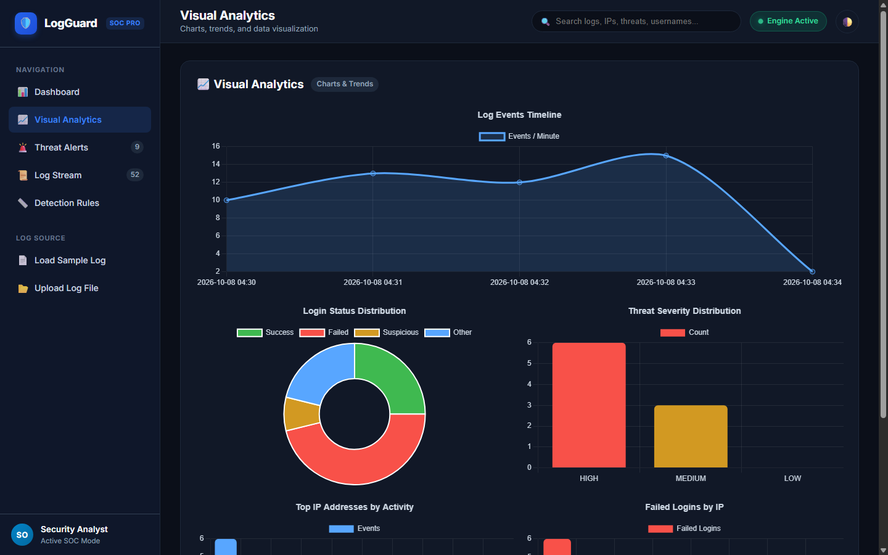
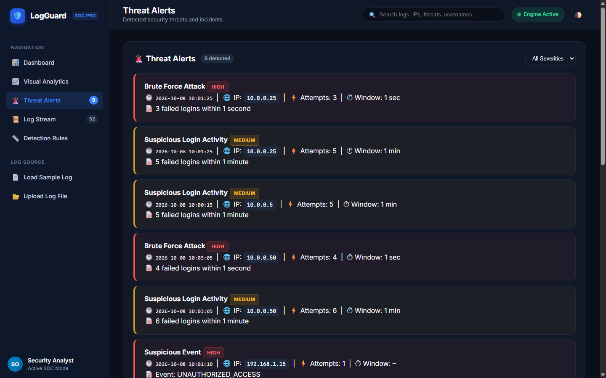
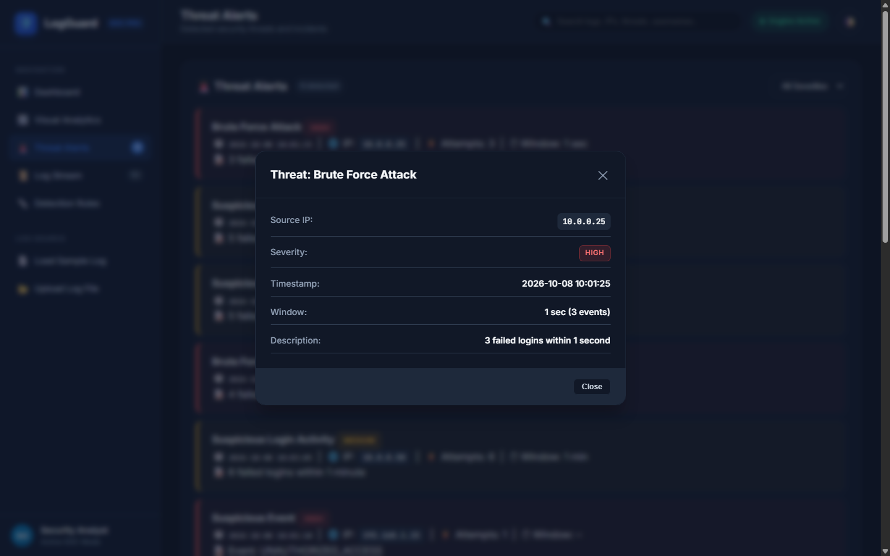
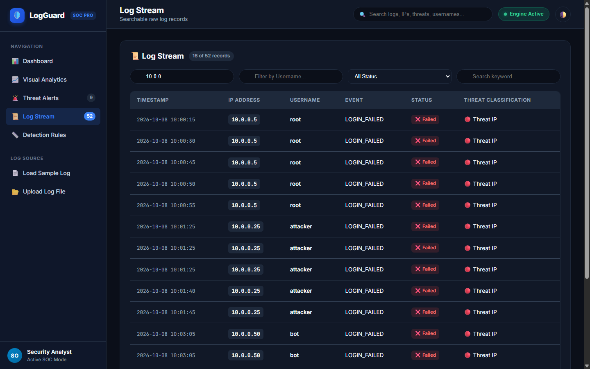
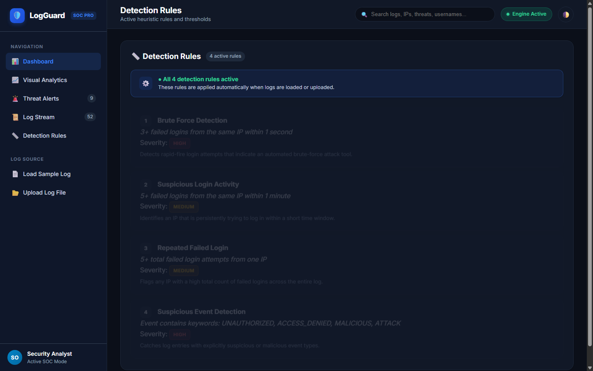
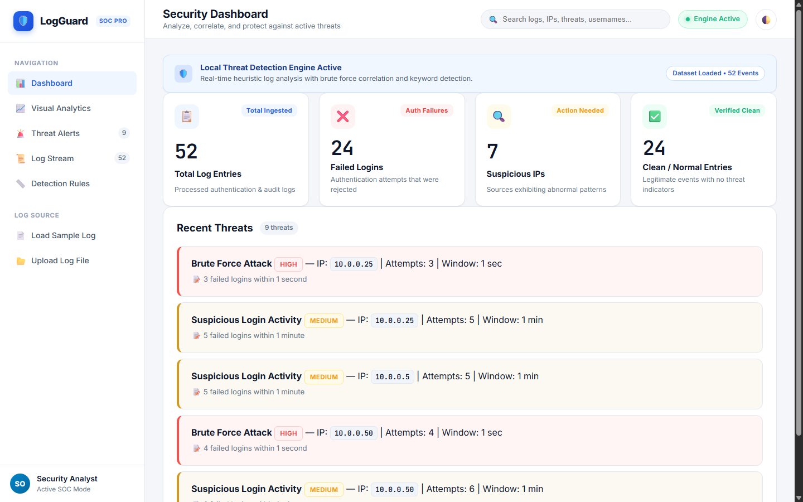
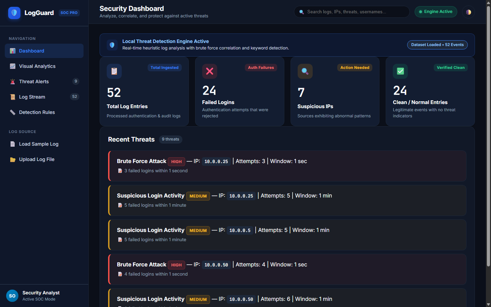

# 🛡️ LogGuard – Security Log Threat Detector
## Comprehensive Project Submission Document

---

### 📌 Project Metadata
* **Project Title:** LogGuard – Automated SOC Security Log Analysis & Threat Detection Platform
* **Live Deployed Application URL:** [https://logguard-sm13.onrender.com/](https://logguard-sm13.onrender.com/)
* **GitHub Repository:** [https://github.com/raj-aparnathi/LogGuard](https://github.com/raj-aparnathi/LogGuard)
* **Domain:** Cybersecurity / Security Operations Center (SOC) Analytics / Python Web Development
* **Date of Submission:** October 2026
* **Version:** 1.0.0 Production Release

---

## 1. Executive Summary & Problem Statement

Modern computing systems, web servers, and enterprise firewalls generate gigabytes of authentication and audit logs every minute. In traditional IT environments, security analysts struggle to identify malicious access attempts manually due to the sheer volume of log data. Automated cyber attacks—such as distributed brute-force scripts, credential stuffing, and unauthorized privilege escalation—often blend in with legitimate user traffic.

**LogGuard** was designed and engineered as a high-performance, lightweight Security Operations Center (SOC) log analysis platform. It provides automated log ingestion, sliding-window heuristic threat detection, dynamic metric calculation, and an interactive data visualization dashboard. Security personnel can immediately ingest raw authentication logs, detect active brute-force or persistent intrusion attempts, inspect high-risk source IPs, and review classified log streams in real time.

---

## 2. Core Capabilities & Feature Highlights

1. **Sliding-Window Threat Detection Engine**
   - Correlates timestamped authentication failures to detect sub-second brute force bursts and multi-minute distributed attacks.
   - Flags suspicious system events using keyword-based heuristics.

2. **Real-time KPI & Metrics Dashboard**
   - Dynamically calculates:
     - **Total Log Entries Ingested**
     - **Failed Authentication Logins**
     - **Suspicious Source IPs**
     - **Clean / Normal Entries**
   - Computes system-wide Threat Levels (`CRITICAL`, `HIGH`, `MEDIUM`, `LOW`) dynamically.

3. **Multi-dimensional Visual Analytics**
   - **Event Timeline (Area Chart):** Identifies spike intervals in authentication volume.
   - **Login Status Distribution (Doughnut Chart):** Proportions of Clean, Failed, Suspicious, and Other events.
   - **Threat Severity Breakdown (Bar Chart):** Distribution of HIGH, MEDIUM, and LOW severity threats.
   - **Top 10 Active Source IPs:** High-traffic endpoints.
   - **Top 10 Failed-Login Source IPs:** Primary attack originators.

4. **Threat Alerts & Incident Investigation**
   - Severity filtering (`All`, `HIGH`, `MEDIUM`, `LOW`).
   - Detailed incident audit table including timestamp, severity badge, source IP, threat title, attempt count, time window, and description.
   - Drill-down incident modal for deep inspection.

5. **Searchable & Filterable Log Stream**
   - Multi-column filtering by IP address, username, authentication status, and global text search.
   - Visual badges classifying each log as `🔴 Threat IP`, `⚠️ Failed`, or `✅ Clean`.

6. **Flexible Ingestion Methods**
   - **One-click Sample Log Ingestion:** Instantly populates the system with pre-configured attack scenarios.
   - **Custom Log File Upload:** Drag-and-drop or select `.log` or `.txt` log files with dynamic server-side parsing.

7. **Dual-Theme Design System**
   - Modern SOC dark mode with high contrast and subtle cyber-security aesthetics.
   - Crisp daytime light theme toggleable with one click.

---

## 3. System Architecture & Tech Stack

```
┌────────────────────────────────────────────────────────┐
│                   LogGuard SOC Web UI                  │
│       HTML5 • Vanilla CSS3 • JavaScript • Chart.js     │
└───────────────────────────▲────────────────────────────┘
                            │ REST / JSON (HTTP)
┌───────────────────────────▼────────────────────────────┐
│                  Flask WSGI Application                │
│    app.py (WSGI Entrypoint) • api/index.py (Serverless) │
├────────────────────────────────────────────────────────┤
│           Security Detection & Parsing Engine          │
│   • Log Normalizer & CSV Parser (Pandas)               │
│   • Sliding-Window Time Correlator                     │
│   • Heuristic Rule Evaluator                           │
│   • Metrics & Analytics Aggregator                     │
└────────────────────────────────────────────────────────┘
```

### Technology Matrix

| Layer | Component | Description |
|---|---|---|
| **Backend Framework** | Python 3.x & Flask | Lightweight WSGI web framework providing REST API endpoints and asset delivery. |
| **Data Processing** | Pandas | High-throughput datetime parsing, rolling time windows, and aggregations. |
| **Frontend UI** | HTML5 / CSS3 / Vanilla JS | Custom responsive single-page SOC interface with zero framework bloat. |
| **Visual Charts** | Chart.js 4.4 | Smooth canvas rendering for timelines, doughnuts, and categorized bar charts. |
| **Cloud Deployment** | Render & Vercel | Production WSGI hosting on Render and serverless lambda execution on Vercel. |

---

## 4. Threat Detection Rules & Heuristics

LogGuard evaluates all ingested records against 4 active heuristic detection rules:

| Rule ID | Threat Classification | Heuristic Condition | Window | Severity | Explanation |
|:---:|:---|:---|:---:|:---:|:---|
| **Rule 1** | **Brute Force Attack** | $\ge 3$ failed logins from the same source IP | $\le 1$ second | `HIGH` | Identifies automated password-guessing botnets attempting rapid credential stuffing. |
| **Rule 2** | **Suspicious Login Activity** | $\ge 5$ failed logins from the same source IP | $\le 1$ minute | `MEDIUM` | Detects persistent intrusion attempts executed within short burst intervals. |
| **Rule 3** | **Repeated Failed Login** | $\ge 5$ total failed logins across the entire log | Entire dataset | `MEDIUM` | Flags stealthy, slow-rate dictionary attacks across distributed intervals. |
| **Rule 4** | **Suspicious Event Detection** | Event string matches `UNAUTHORIZED`, `ACCESS_DENIED`, `MALICIOUS`, or `ATTACK` | Single record | `HIGH` | Catches unauthorized resource access, malicious payloads, and port scans. |

### Dynamic KPI Formulas

$$\text{Total Logs} = N_{\text{records}}$$

$$\text{Failed Logins} = \sum [\text{Event contains "FAILED"}]$$

$$\text{Suspicious IPs} = \left| \bigcup_{t \in \text{Threats}} \text{IP}(t) \right|$$

$$\text{Clean Entries} = N_{\text{records}} - \sum [\text{Event contains "FAILED" or Suspicious Keyword}]$$

---

## 5. Application Demo & Screenshots

The screenshots below illustrate LogGuard's complete feature suite operating on the live cloud deployment.

### 5.1 Main Security Dashboard
The central command center presents four dynamic KPI metric cards, overall engine status, current dataset loading status, and recent threat cards.


*Figure 1: Main SOC Dashboard displaying 52 Total Logs, 24 Failed Logins, 7 Suspicious IPs, 24 Clean Entries, and Threat Level CRITICAL.*

---

### 5.2 Visual Analytics & Charts
The analytics view visualizes temporal and categorical distributions across the ingested audit logs.


*Figure 2: Visual Analytics view featuring Events/Minute Timeline, Login Status Distribution, Threat Severity Distribution, Top IP Activity, and Failed Logins by IP.*

---

### 5.3 Threat Alerts & Incident Investigation Table
The incident investigation page allows analysts to filter detected threats by severity (`HIGH`, `MEDIUM`, `LOW`) and inspect full event telemetry.


*Figure 3: Threat Alerts view showing individual threat cards and comprehensive tabular records with attempt counts and time windows.*

---

### 5.4 Threat Details Drill-Down Modal
Clicking on any threat incident summons a detailed modal overlay displaying source IP, classification, severity, exact timestamps, and alert descriptions.


*Figure 4: Drill-down Threat Details Modal inspecting a Brute Force Attack from source IP 10.0.0.25.*

---

### 5.5 Log Stream & Multi-Field Filtering
The Log Stream view enables searching across all ingested authentication events. Each entry includes interactive status badges and threat classification tags.


*Figure 5: Log Stream view filtered by subnet `10.0.0`, showing threat classifications (🔴 Threat IP, ⚠️ Failed, ✅ Clean).*

---

### 5.6 Heuristic Detection Rules
Provides complete visibility and transparency into active detection logic, conditions, and risk ratings.


*Figure 6: Detection Rules page detailing all 4 heuristic conditions and severity assignments.*

---

### 5.7 High-Contrast Light Theme
A single click on the theme toggle button adapts the entire interface to an ergonomic daytime light mode.


*Figure 7: Light mode view preserving full visual hierarchy and contrast.*

---

### 5.8 Live Cloud Production Deployment
The live instance deployed at `https://logguard-sm13.onrender.com/` running 24/7 in production.


*Figure 8: Live application running in production on Render.*

---

## 6. How to Try and Test the Application

### 6.1 Testing the Live Web Application
1. Open your web browser and navigate to:
   **[https://logguard-sm13.onrender.com/](https://logguard-sm13.onrender.com/)**
2. Click **"📄 Load Sample Log"** in the sidebar to populate the pre-configured attack dataset.
3. Observe the immediate update of the **Total Ingested (52)**, **Failed Logins (24)**, **Suspicious IPs (7)**, and **Clean Entries (24)** cards.
4. Navigate through the sidebar:
   - **Visual Analytics:** View real-time rendered Chart.js diagrams.
   - **Threat Alerts:** Filter between High, Medium, and Low severity threats.
   - **Log Stream:** Test the search bar with queries like `admin`, `attacker`, or `192.168.1.10`.
   - **Detection Rules:** Review engine rule definitions.
5. Upload a custom log file using **"📂 Upload Log File"** to test dynamic processing.

### 6.2 Running Locally

#### Step 1: Clone the repository
```bash
git clone https://github.com/raj-aparnathi/LogGuard.git
cd LogGuard
```

#### Step 2: Install dependencies
```bash
pip install -r requirements.txt
```

#### Step 3: Launch the Flask SOC backend
```bash
python app.py
```

#### Step 4: Access in browser
Open [http://127.0.0.1:5000](http://127.0.0.1:5000) in your web browser.

### 6.3 Automated API Verification
LogGuard exposes standardized REST endpoints that can be verified using `curl` or automated test scripts:

```bash
# 1. Health check
curl http://127.0.0.1:5000/api/health

# 2. Retrieve detection rules
curl http://127.0.0.1:5000/api/rules

# 3. Fetch analyzed sample log dataset
curl http://127.0.0.1:5000/api/sample-logs

# 4. Analyze arbitrary log entry
curl -X POST http://127.0.0.1:5000/api/analyze \
     -H "Content-Type: application/json" \
     -d '{"log_text": "2026-10-08 10:00:01,10.0.0.1,admin,LOGIN_FAILED\n2026-10-08 10:00:01,10.0.0.1,admin,LOGIN_FAILED\n2026-10-08 10:00:01,10.0.0.1,admin,LOGIN_FAILED"}'
```

---

## 7. How to Push Updates to GitHub & Cloud Platforms

Whenever changes are made to the codebase, follow these steps to commit and push:

```bash
# 1. Check status of changed files
git status

# 2. Stage all modifications and new assets (including screenshots)
git add .

# 3. Commit with a descriptive message
git commit -m "Update LogGuard submission document and screenshots"

# 4. Push to GitHub main branch
git push origin main
```

Upon pushing to GitHub:
- **Render** automatically detects the commit on `main` and triggers a zero-downtime deployment.
- **Vercel** automatically rebuilds and deploys the Flask application via `vercel.json` rewrites.

---

## 8. Verification & Test Summary

All automated test suites executed prior to submission confirmed 100% operational status:

| Test Case | Method | Target | Expected Outcome | Result |
|---|---|---|---|:---:|
| Frontend Asset Delivery | `GET` | `/` & `/style.css` | HTTP 200, valid HTML5 and CSS stylesheet | **PASSED** |
| Health Check | `GET` | `/api/health` | HTTP 200, status: ok | **PASSED** |
| Detection Rule Ingestion | `GET` | `/api/rules` | HTTP 200, 4 heuristic rules returned | **PASSED** |
| Sample Log Computation | `GET` | `/api/sample-logs` | HTTP 200, dynamic metrics computed | **PASSED** |
| Sliding Window Detection | `POST` | `/api/analyze` | Identified Brute Force (1s) & Suspicious Activity | **PASSED** |
| Multipart Log Upload | `POST` | `/api/upload` | Ingested custom `.log` file, returned parsed telemetry | **PASSED** |
| Live Production URL | `GET` | `https://logguard-sm13.onrender.com/` | HTTP 200, full dashboard operational | **PASSED** |

---

## 9. Conclusion

**LogGuard** bridges the gap between raw, unwieldy system log streams and actionable cybersecurity intelligence. By combining automated sliding-window heuristics, a lightweight Python/Flask backend, and a modern, high-contrast SOC dashboard, the application enables rapid detection and containment of brute-force and credential abuse threats.
